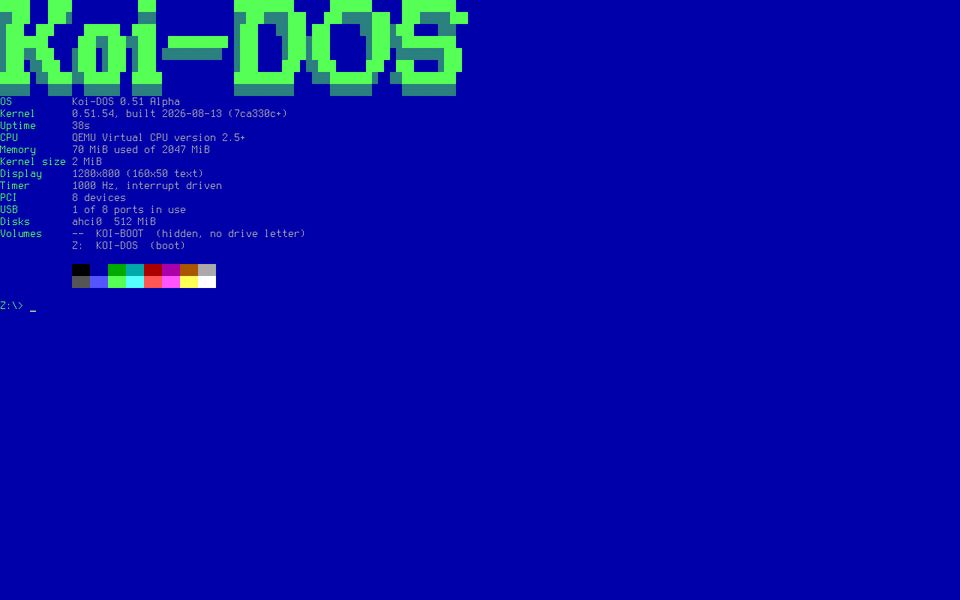
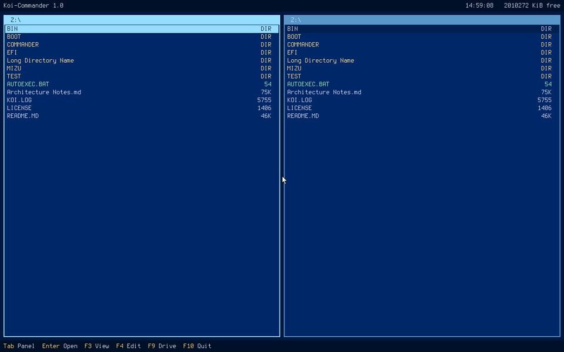

# <samp>Koi-DOS 🥂</samp>

**An operating system you can put on a USB stick, boot on a real machine, and use.**

It looks like DOS and behaves like DOS — a `Z:\>` prompt, drive letters, `dir` and `copy`, batch
files — but underneath it is a 64-bit kernel written from nothing for UEFI machines made this
decade. No BIOS, no real mode, no emulator required. It boots on hardware from 2026 and gives you
a machine that fits in your head.

<p align="center">
  
</p>

---

## Try it

Three steps, about five minutes.

1. **Download** `koi-dos-0.9.img` from
   [Releases](https://github.com/quartzz720/Koi-DOS/releases).
2. **Write it to a USB stick** with [Rufus](https://rufus.ie) or
   [balenaEtcher](https://etcher.balena.io) — pick the image, pick the stick, write. In Rufus,
   choose **DD image mode** if it offers the choice.
3. **Boot from the stick** and, at the prompt, type:

   ```
   SETUP
   ```

That installs it onto a disk in the machine. Nothing is written anywhere until you have chosen a
disk, read the licence, and typed the disk's name out in full — and the disk you booted from is
never offered as a target.

**Just want a look?** Do not type `SETUP`. The stick is a whole working system on its own; poke
around and pull it out when you are done. Nothing on the machine has been touched.

**No spare machine?** It runs in QEMU:

```
qemu-system-x86_64 -m 2G -machine q35 -drive format=raw,file=koi-dos-0.9.img \
  -drive if=pflash,format=raw,readonly=on,file=/usr/share/edk2/ovmf/OVMF_CODE.fd
```

> **⚠️ It formats real disks.** `SETUP` erases the disk you point it at, completely. It asks
> several times and it never offers the one it is running from, but it is a real installer and
> it does what you tell it. On a machine with something on it you care about, use QEMU.

---

## What you get

**A shell that behaves like DOS.** `dir`, `cd`, `copy`, `type`, `del`, `ren`, `md`, `tree`,
`more`, `attrib`, `find`, `sort`, `xcopy`. Redirection and pipes: `dir > list.txt`,
`type log.txt | find "error"`. Environment variables and `SET PATH=`. Batch files with `IF`,
`GOTO`, `FOR`, `CALL` and arguments, so `AUTOEXEC.BAT` can actually decide things.

**A file manager**, in the line Norton started — two panels, a mouse, a viewer and an editor.

<p align="center">
  
</p>

**A desktop with windows**, in the shape Windows 3.0 had: overlapping windows you can drag and
resize, a menu bar, a taskbar, a control panel, a clock, a notepad and a WAV player. It is a
package called **Mizu**, not part of the system — install it, remove it, and what is left is the
same Koi-DOS.

**Games**, a system summary, sound, a network stack that gets an address over DHCP and answers
pings, and a package manager that fetches programs over the wire.

**And DOOM.** id Software's, with four files replacing the Unix layer and the game code
untouched. Bring your own WAD.

---

## What it is, and what it is not

**It is a real operating system.** It boots on bare metal, leaves UEFI behind, and drives the
hardware itself: its own memory manager, interrupt tables and page tables; keyboards over PS/2
and USB; disks over AHCI, NVMe and USB storage; FAT32 it reads *and writes*; HD Audio; an Intel
network card and a phone tethered over USB. It has been booted on real laptops and desktops, not
only in a virtual machine.

**It is not Linux, and not trying to be.** One program runs at a time, in ring 0, with no memory
protection — the way DOS worked, on purpose. A program here can ask the processor its own name
because nothing stands between them. That is a trade: it makes the system small enough to
understand and unable to protect itself from a bad pointer.

**It is not MS-DOS compatible.** "DOS-like" means the look and the character, not binary
compatibility. Programs are native 64-bit ones with their own system-call interface. Old DOS
binaries will not run.

**It is 0.9, a pre-release.** Everything described here works and has been tested, but it is
young. Two things are known and deliberate: `LABEL` and `MODE` report rather than change - the
volume label needs a filesystem write that does not exist yet, and the screen mode is fixed by
the loader before UEFI hands over. Both say so when you run them.

Two deliberate departures from DOS:

**The system volume is `Z:`**, not `C:`. In MS-DOS, `A:` and `B:` were reserved for floppy drives
and the system landed on `C:` only because that was the first letter left over. Floppies are
gone, and handing the system `A:` is not appealing either. Further volumes go `Y:`, `X:` downward.

**Long file names work in full.** The 8.3 limit was a consequence of 1980 hardware, not a design
goal, and this is what DOS would look like if it turned up on a UEFI machine today. Short names
still exist underneath every entry, but they are not what you see.

---

## Installing programs

Koi-DOS carries a package manager. On a machine with a network:

```
Z:\> net start
Z:\> dosget list
Z:\> dosget install games
Z:\> games
```

Each package installs into a directory of its own and puts itself on the search path, so it runs
by name from anywhere. `dosget remove` takes it away again, and only ever deletes what it
installed — never anything in a directory it does not own.

The installation medium already carries Koi-Commander, Mizu, the games and dosfetch, because the
machine most likely to need them is the one whose wireless card this does not drive yet.

> **`[NEW]`  The first programs written for Koi-DOS with the official SDK:**
>
> **[DOSFETCH](https://github.com/quartzz720/DOSFETCH)** — a system summary in the spirit of
> neofetch.
>
> **[Games](https://github.com/quartzz720/Games)** — Snake, Tetris, Pong, Breakout, Reversi and
> Minesweeper, in one program with a menu.
>
> **[K-DOOM](https://github.com/quartzz720/K-DOOM)** — id Software's DOOM, on Koi-DOS. Bring your
> own WAD: the source is GPL, the game data is not.
>
> **[Mizu](https://github.com/quartzz720/Mizu)** — the desktop.
>
> All four are built with nothing but [sdk/](sdk/), in their own repositories. That is the point
> of them: if one stops building, the SDK is broken for everybody rather than only for programs
> that happen to live in this tree.

---

## What it does

The kernel boots on bare metal, leaves UEFI Boot Services behind, installs its own GDT, IDT and
page tables, brings up a keyboard over PS/2 or USB, finds disks over AHCI, NVMe and USB storage,
parses the partition table, mounts FAT32, and runs a shell that loads programs off that disk. It
can install itself onto a disk, and it can hand the screen to a program that wants to draw.

```
KOI DOS KERNEL
MEMORY ALLOC FREE: OK
MEMORY FREE: 1970 MB
CPU: GDT IDT PIC READY
PAGING: IDENTITY MAP 16384 MB, FRAMEBUFFER WRITE COMBINING
HEAP: 1023 KB, SELF TEST OK
KEYBOARD: PS/2 READY
TIMER: PIT POLLING 1000 HZ
APIC: TIMER 62652 KHZ, CALIBRATED
TIMER: LOCAL APIC, INTERRUPT DRIVEN
TIMER: 100 HPET MS COUNTED AS 100 MS WITHOUT POLLING
KEYBOARD: MOVED TO THE IO APIC
PCI: 9 DEVICES
AHCI: DISK 192 MB
NVME: DISK 128 MB
AUDIO: QEMU CODEC, 48 KHZ STEREO
XHCI: 2 OF 2 CONTROLLERS
XHCI: 2 OF 16 PORTS IN USE, KEYBOARD, STORAGE
VOLUMES: 4 FAT32 OF 4
SYSTEM VOLUME: KOI-DOS - the loader's partition has no drive letter

Z:\> dir \bin
 Volume in drive Z is KOI-DOS
 Directory of Z:\BIN

2026-08-07  04:17        13576  CAT.EXE
2026-08-07  04:17        18232  COLOR.EXE
2026-08-07  04:17        14352  DEMO.EXE
2026-08-07  04:17        13440  HELLO.EXE
2026-08-07  04:17        13496  LS.EXE
2026-08-07  04:17        13576  SAVE.EXE
2026-08-07  04:17        47032  SHOW.EXE

       7 file(s)          133704 bytes
       0 dir(s)        65536000 bytes free
```

Most of those boot lines are a claim being checked rather than a step being announced. The memory
figure comes from an allocate-and-free round trip, the heap from a self test, and the two timer
lines are one clock measuring another — the second is the measurement the polled PIT could not
make at all, because it used to read 100 ms as 0.

### Commands

| | |
|---|---|
| `dir [path] [/w]` | list a directory; `/w` gives names only |
| `cd`, `chdir` | change directory, `cd ..` to go up |
| `type` | print a file |
| `more` | print a file a screen at a time |
| `tree [path]` | the directory tree, drawn in CP437 |
| `attrib [+-RHSA] file` | show or change attributes |
| `copy`, `del`/`erase`, `ren`/`rename` | file management |
| `md`/`mkdir`, `rd`/`rmdir` | directories |
| `vol`, `date`, `time` | volume label and the clock |
| `mem` | memory, and what the drivers actually found |
| `pci` | every function on the PCI bus, with its class |
| `disk` | disks and partitions, whether or not they have a drive letter |
| `chkdsk [d:] [/F]` | check a volume; `/F` repairs, without it nothing is written |
| `format <part>` | make a new filesystem — destroys everything on it |
| `part <disk>` | replace the partition table — destroys the whole disk |
| `setup` | install Koi-DOS onto a disk |
| `shutdown`, `reboot` | through ACPI, which is the only way there is |
| `beep [hz] [ms]` | a tone, if the machine has a sound device |
| `sound` | the sound device, and which output it chose |
| `log [file]` | the kernel log: on screen, or written to a file |
| `echo`, `ver`, `cls`, `help` | the usual |
| `set [name=value]` | environment variables; `PATH` and `PROMPT` live here |
| `find "text" [file]` | the lines that contain it; `/v` `/c` `/n` `/i` |
| `sort [file]` | the lines in order; `/r` reverses |
| `xcopy <dir> <dir>` | a directory and everything under it |
| `label`, `mode` | what a volume is called, and how the console is set |
| `dosget <..>` | packages: `list`, `install`, `update`, `remove` |
| `net <..>` | the network: `start`, `set`, `status` |
| `pause`, `goto`, `if`, `for`, `call`, `shift` | batch files |
| `Z:` | change drive |

Redirection and pipes work the way they did in DOS:

```
Z:\> dir > list.txt              send the output there
Z:\> echo done >> list.txt       add to it
Z:\> sort < list.txt             read from there
Z:\> dir | find "BAT" /i         the right-hand side reads the left's output
```

A pipe is a temporary file, exactly as it was in DOS, and for the same reason: nothing runs
alongside anything else, so what passes between two commands has to be somewhere in the meantime.

**Ctrl+C stops a running program** and returns to the prompt, and stops a batch file rather than
letting it carry on to the next line. It cannot interrupt a loop that calls nothing at all -
such a program never enters the kernel to be interrupted - but everything that prints, reads a
key, sleeps or touches a file can be stopped.

The three destructive ones ask before they act, and none of them will touch the device the system
is running from. `format` and `part` require the partition or disk to be typed back by name —
`y` is too easy to press by reflex — and `setup` shows the licence and the layout it is about to
write before it writes anything.

`log` is the same idea taken to its end. Every driver says what it found and why it gave up over
COM1 — and no machine made this century has a COM1. The text is kept in memory as well, so `log`
prints it and `log KOI.LOG` writes it to a file, which is the only way to get a boot log off a
laptop and onto something that can read it. It was written the first time a sound card failed on
real hardware and the explanation went to a port that was not there.

`mem` doubles as the system's self-description, because the alternative to a line reading
`USB : keyboard, storage` is rebooting with a serial cable attached to find out whether a driver
came up:

```
Z:\> mem
Physical memory : 2047 MB
Available       : 1973 MB

Kernel image    : 2200 KB
Page tables     : 80 KB
Identity map    : 16386 MB (RAM and device windows)
Heap            : 1023 KB
Heap free       : 1023 KB

PCI devices     : 9
Disks           : 3  ahci0, nvme0, usb0
Volumes         : 3  Z:, Y:, X:
USB             : keyboard, storage (2 of 16 ports in use)
Audio           : QEMU codec, 48 kHz stereo
```

`ver` carries a build number, which during development is worth more than the version — two
kernels both claiming 0.5 differ by whatever happened in between. The number is the commit count,
so it only moves when history does, and a trailing `+` means the tree had uncommitted changes
when that kernel was built:

```
Z:\> ver
Koi-DOS 0.5 Alpha
Kernel 0.5.23, built 2026-08-07 (18400fe)
A DOS-like operating system for UEFI machines.
```

Patterns work where they should — `dir *.exe`, `copy *.txt backup`, `del *.bak`. `*` matches any
run of characters including dots, `?` exactly one. `del` with a pattern asks first.

Paths use backslashes. Forward slash introduces switches, as in DOS. All three path forms are
accepted and mean different things: `EFI\BOOT` from the current directory, `\EFI\BOOT` from the
root of the current drive, `Z:\EFI\BOOT` from the root of a named one.

Batch files run a line at a time; `@` suppresses the echo, `rem` and `:` are comments and labels,
and `AUTOEXEC.BAT` at the root of the boot drive runs at startup.

### Programs

Anything that is not a built-in command is looked up on disk as `NAME` or `NAME.EXE` — first in
the current directory, then at the root of the drive, then in `\BIN` — and given the rest of the
line as its arguments. `\BIN` is where an installation puts them, because the root of the system
volume is for the user's files and a pile of `.EXE` in it turns `dir` into a search. Ten ship
in [programs/](programs/):

| | |
|---|---|
| `hello` | prints its arguments and the version — the smallest complete example |
| `cat <file>` | prints a file, reading it through the system calls rather than asking the shell |
| `save <file> <text>` | writes its arguments to a file |
| `ls [pattern]` | a directory listing written as an ordinary program |
| `color` | changes the console colours and remembers them |
| `demo` | every drawing primitive on one screen, as a test that happens to look like something |
| `show <file.bmp>` | displays an uncompressed 24- or 32-bit BMP, centred |
| `play <file.wav>` | plays a WAV through the mixer; any key stops it |
| `edit [file]` | a full-screen text editor, in the spirit of `nano` |
| `selftest [/K]` | reproduces known failures and writes a report, in bytes and in words |

`ls` and `color` exist to prove two specific things: that the directory-enumeration calls are
enough to write a listing with no privilege the shell does not also lack, and that a program can
change how the system looks and make it stick without reaching into kernel state.

### Koi-Commander

**Koi-Commander is a file manager with two panels, and it does not ship with the system.** It arrives with `dosget
install commander`, lands in `\COMMANDER`, is started by typing `\COMMANDER\COMMANDER`, and can be removed again — a
graphical shell that cannot be taken off is an operating system with a graphical shell, and this
is not one. The source is [programs/commander.c](programs/commander.c); it is built by the same `make` and
uses nothing the SDK does not give everybody.

Two panels side by side, which is Norton Commander's arrangement and Windows 1.0's conclusion
from the other direction: overlapping windows on one screen hide more than they show. The pointer
selects, twice quickly opens, the wheel scrolls whichever panel it is over — and on a laptop the
wheel is two fingers on the touchpad, because the pad recognises the gesture itself and reports
it as wheel notches. `Tab` switches panels, `F3` shows a file, `F4` edits one, `F9` changes drive,
`F10` leaves. Everything with a pointer also has a key: on a machine with no touchpad the keys are
the whole interface rather than a degraded version of one.

It was called Mizu while it was the only graphical thing here; the name has gone to what
comes next - a desktop, with windows - and this kept the one that describes it. Finished rather
than abandoned: two panels answer "where is it" and "where is it going", and a program that
answers its question does not need to become something else.

`F4` is a notepad, and it is the second front end over the same editing core as `edit` — the one
the system ships with and draws on the console. Two editors, one buffer implementation, because a
text buffer is where the off-by-ones live and two copies written a week apart do not stay the same
shape. What the graphical one adds is what a pointer is for: a click puts the caret where the
finger is, a drag selects, and the clipboard it cuts into is the kernel's, so what leaves the
notepad can be pasted into `edit` and the other way round.

Starting a program from it goes through `SYS_CHAIN`. It asks for itself to be run, then for the
program, and exits; the requests are honoured most-recent-first, so the program runs in the memory
it was occupying and it comes back afterwards with its two paths and its selection handed to
itself as arguments.

1.0 does not copy, move, delete or rename, and both panels show the same drive. Those are next.

**Why the source is in this repository when the program is not part of the system.** It is
currently the only thing that calls `SYS_MOUSE` and `SYS_SETDRIVE`, and both were added because
it needed them. While an interface is still moving, its only consumer has to be built by the same
`make` — otherwise a break is found by a user rather than by the compiler. DOSFETCH, Games,
K-DOOM and Mizu live outside this tree for the opposite reason: they test that a *settled* SDK
still works. Mizu made that move when the windowing library settled; the commander joins them
when the pointer and drive calls do.

Three more proofs live outside this repository on purpose, each built with nothing but the SDK:
**[DOSFETCH](https://github.com/quartzz720/DOSFETCH)**, a system summary in the spirit of
neofetch; **[Games](https://github.com/quartzz720/Games)**, six of them in one program with a
menu; and **[K-DOOM](https://github.com/quartzz720/K-DOOM)**, id Software's DOOM with its Unix
layer replaced. If one stops building, the SDK is broken for everybody rather than only for
programs that happen to sit in this tree.

Games proves the graphics calls, because it is the only thing here that draws sixty times a
second. DOOM proved something less comfortable: it is the first program that kept a live value in
a register across a system call, and it found that the stub had never preserved the registers
this document promised it would.

```
Z:\> color                 show the presets and the palette
Z:\> color amber           a preset: dos, mono, amber, green, paper, night
Z:\> color /b black        just the background
Z:\> color yellow blue     text and background
```

### Sound

**HD Audio**, because AC'97 is emulated everywhere and fitted to nothing: every machine this
could run on has an HDA controller, and QEMU emulating the easy one as well is a trap rather than
a shortcut. Works on real hardware, where it found the one thing QEMU could never have shown —
see below. **The PC speaker is not used at all** — no laptop has had one for years, and the
thing that makes the noise is the same chip the headphone socket comes out of.

The driver does one thing — it finds a codec, traces a path from a physical output back through
whatever mixers and selectors are in the way to a converter, unmutes every step of it, and leaves
a single stream of 48 kHz stereo running over a ring of memory forever. It never starts or stops:
a stream started per sound clicks, and one that always runs does not.

**Which output** is decided by what is plugged in, not by what the socket is called. Ranking by
name — line out, then headphones, then the built-in speaker — is right on a desk and wrong on a
laptop, where it picks the headphone socket and leaves the machine silent with nothing in it. So
a jack that reports something plugged into it wins; the built-in speaker comes next, because it
is always there; a jack that cannot report comes after that, since guessing "empty" would silence
a machine that works; and a jack that reports nothing plugged in is not used. External amplifiers
are switched on where the codec has one — a laptop whose speakers are wired through one is silent
without that while every register reads correctly.

`sound` prints all of it. "There is no sound" has several completely different causes that are
identical from a chair — no controller, a controller with no codec, a codec whose only outputs
are digital, an empty headphone socket, or the right socket chosen and muted further along — and
the codec's own description of its outputs is the difference between guessing and knowing:

```
Z:\> sound
Codec           : Realtek (10EC0295)
Output          : speaker, converter at node 2
Rate            : 48000 Hz, stereo, 16-bit
Volume          : 200 of 255
Voices          : 0 of 16 playing

Analogue outputs the codec describes:
  node 20 speaker    built in                 <- in use
  node 33 headphones nothing plugged in
```

It measures the jacks when asked rather than showing what startup found, so a socket can be
tested by plugging something into it instead of by rebooting, and `sound <node>` sends the output
to one of them by hand — the only measurement that separates a socket that cannot be sensed from
one that cannot be driven. Both exist because of a laptop that reported an empty headphone socket
while headphones were in it, and the cause was worth the trouble: **a pin that is switched off
does not measure**, and says so as "nothing there" rather than as an error. Presence was being
read during startup, before any output had been chosen — so every jack was asked while its own
sense circuit was off. A pin that reports nothing now has its output switched on, is asked again,
and has its control register put back as it was. The same laptop found the other half of it: two
pins fed by one converter both play, so switching to the headphones was adding them to the
speaker rather than moving to them. A pin being left is now silenced.

Everything above that is [kernel/audio.c](kernel/audio.c), which has no hardware in it. Sixteen
voices, each with its own rate, volume and pan, resampled into the ring in 32.32 fixed point —
there is no floating point anywhere, because nothing configures SSE state after
`ExitBootServices`.

**The cache is flushed on the way out.** On x86 a device's DMA snoops the processor's caches, so
this should be unnecessary — and on the first real machine it was not. That controller marks its
stream traffic with a priority bit it will not let anyone clear, and traffic marked that way does
not snoop: the descriptor list had never left the cache, so the controller read a list of
zero-length buffers, transferred nothing and reported no error, because a buffer of zero bytes is
not an error. Meanwhile the command rings worked perfectly, because they are not a stream. Two or
three cache lines per millisecond, and it is the difference between silence and sound.

**The mixer runs from the timer interrupt.** Not for precision: forty-eight frames a millisecond
is nothing. It is because the alternative is mixing wherever the system happens to be looping,
and the moment a program stops making system calls — a game rendering a frame, a copy grinding
through a large file — the sound would stop with it. Measured: a tone held through a graphics
program starting, drawing and exiting, with not one silent 20 ms block in it.

**[K-DOOM](https://github.com/quartzz720/K-DOOM) is the first thing to use it**, and it needed
exactly one addition to do so: `SYS_SOUND_PARAMS`, which changes a sound that is already playing.
DOOM calls it every tic for every sound whose source has moved relative to the player, and
without it a rocket stays where it was fired.

The whole path was checked from outside the guest rather than by ear. QEMU records what the
machine played into a file, and the file is measurable where a noise in the room is not: a tone
asked for as 440 Hz for one second measures as 440 Hz for 1.000 seconds; six pistol shots in DOOM
land at the six moments the keys were sent, each the length `DSPISTOL` is at 11025 Hz, because a
wrong sample rate shows up as a wrong duration; and a sound panned from one side to the other
comes out silent in the far channel at each end and full in both at the centre.

### Writing programs without the kernel source

[sdk/](sdk/) holds the four files a program needs — the header, the entry stub,
the linker script and the system call definitions — plus a one-line build
script, so a program can be written and built by someone who does not have the
kernel checked out:

```bash
cd sdk && ./koicc mytool.c              # produces MYTOOL.EXE
./koicc main.c board.c -o mytool        # several sources, one program
```

No special compiler: a Koi-DOS program is a freestanding ELF64 binary, and an
ordinary x86-64 GCC produces one. `sdk/README.md` documents the ABI.

`koilib.c` comes with it: the memory and string primitives, character
classification, number conversion, a `printf`-style formatter and a heap. Not
a C library and not trying to be one — this is the subset that either the
compiler requires or that any program larger than a page rewrites badly on its
own. The compiler emits calls to `memcpy` and friends whatever you do, so
those four are not optional. Unused parts are collected at link time, so a
program that wants `strlen` does not also carry a formatter.

Several sources are one program, not several — there is no linker step to run
afterwards and no object files to keep. Anything larger than a single file
needs this, and the first program that did was a games collection.

**Programs you write are yours.** Including these headers does not place your
program under this project's licence; see the LICENSE.

### Configuration

Settings live in `\BOOT\CONFIG` as a directory of small files, one owner each, read at boot
before the shell paints anything. One `key = value` per line; a line whose first character is
`#` or `;` is a comment; unknown keys are ignored and a missing file is not an error.

```ini
# \BOOT\CONFIG\CONSOLE.CFG - written by color.exe, read by the kernel at boot.
foreground = yellow
background = black
prompt = brown
```

```ini
# \BOOT\CONFIG\SYSTEM.CFG - the search path, kept up to date by dosget.
path = \COMMANDER;\MIZU;\GAMES
language = ru
```

One file per owner rather than one shared file, and that is a scar: everything used to write the
same file from what it happened to know, so the second writer destroyed the first one's keys -
the file manager recorded that it had asked its questions, somebody changed a colour, and the
machine asked them again. Two programs that never open the same file cannot collide at all, and
that is a property of the arrangement rather than of everybody remembering a rule.

A comment is a whole line, decided by its first character, and that is a scar too: `;` also
separates the entries of the search path, so a comment that could begin in the middle of a value
read `path = \COMMANDER;\MIZU` as `\COMMANDER` and lost everything after the first entry, one
boot after it was written.

### System calls

Programs call the kernel with `int 0x40`, in the spirit of DOS's INT 21h. `RAX` holds the
function number, `RDI`/`RSI`/`RDX`/`RCX` the arguments, `RAX` the result. 68 calls cover
console I/O, files, directory enumeration, the command line, exit codes, the environment, what
the system knows about itself, taking the screen, making a noise and running another program; they are listed in
[include/syscall.h](include/syscall.h), which the kernel and every program include from the same
copy so the two cannot drift apart. That file also names the keys that have no ASCII value — the
arrows and the function keys — because a program that reads them has to name them, and two copies
of a number is how two copies of a number drift apart.

`SYS_GFX_PRESENT_RECT` sends one rectangle instead of the whole screen, and it is the difference
between a game that runs and one that crawls: the screen is whatever size the firmware chose,
often far larger than the area a program uses, and sending all of it sixty times a second costs
more than everything else put together.

Three of those exist for programs that cannot afford to stop. `SYS_GETCHAR` waits, which is right
for a prompt and wrong for anything that has to keep moving; `SYS_KEYPRESSED` asks whether a key
is waiting without taking it, and `SYS_SLEEP` waits without spinning.

`SYS_KEYEVENT` answers a different question again: **which key went down, and which came up**. A
character stream cannot say that a key is being *held* — it has no idea a key is still down and no
idea when it stopped being — so anything where that matters, walking forward or steering or
holding a button, needs events rather than characters. Both drivers had the information all along
and were discarding it one line before it could be delivered. The identity reported is the
unshifted one, so a key reads the same going down as coming up.

`SYS_MOUSE` fills in one snapshot: where the pointer is, which buttons are down, how far the
wheel has turned, and **how many times each button has gone down**. That last one is not a
convenience. A click lasts a tenth of a second at most, and a program that looks thirty times a
second will sooner or later look between the press and the release and see nothing — which
presents as a button that sometimes does not work rather than as a missed sample. A count cannot
be missed: the reader compares it with what it last saw. The wheel is a running total for the
same reason, and because a total can be read by any number of callers where a
since-you-last-asked figure can only be read by the first one.

`SYS_CLIP_PUT` and `SYS_CLIP_GET` are the clipboard — one buffer, in the kernel, outliving the
program that filled it. It belongs to the kernel rather than to a shell for the only reason that
matters: a clipboard that dies with its program cannot carry anything between two programs, which
is the only thing anybody wants one for. Windows 1.0 shipped one in 1985 and put it on the box.

`SYS_RUN` runs another program and comes back when it ends, with everything the caller had in
memory still there — four programs can be resident at once, each in its own slot, and only one of
them is running at any moment. That is a smaller claim than multitasking and it is the whole of
what "run this and come back" needs; it is what DOS's EXEC did.

`SYS_CHAIN` is the older, cheaper answer, and it is still here because it is sometimes the right
one: it asks for a command to be run **after the calling program has exited**, giving up the
memory rather than holding it. Requests run most-recent-first. Coming back is a fresh start and
not a resume, so anything worth keeping travels back as arguments or goes to a file first. Small
DOS shells did precisely this, for precisely this reason.

`SYS_SOUND_PLAY` and `SYS_SOUND_TONE` put something into the one stream that is always running.
There is nothing to open and nothing to wait for: a call hands back a voice, or -1 when every
voice is busy or the machine has no sound hardware. **The samples are not copied**, which is what
makes firing the same effect twenty times a second free — and it is why every voice is stopped
when a program exits. A voice holds a pointer into the program's memory and the mixer reads it
from the timer interrupt; left running past its program, it would not make a wrong noise once, it
would make one a thousand times a second forever.

`SYS_ALLOC` and `SYS_FREE` give a program whole pages beyond its own image. Not a malloc and not
meant to be one: a program that wants small objects takes one large block and divides it itself.
Everything is released when the program exits, whether or not it remembered to — nothing here
reclaims memory later, so a leak would otherwise be permanent.

The vector is `0x40` rather than `0x21` because in protected mode `0x21` is the keyboard IRQ.
`INT` rather than `SYSCALL`/`SYSRET` because the whole value of `SYSRET` is a fast ring 3 to
ring 0 transition, which does not happen in a ring-0 monolith.

**A program carries the interface version it was built against**, and the kernel checks it before
running anything. Both directions are refused while the interface is ALPHA. Newer is obvious — it
would call functions this kernel does not have. Older is the surprising half: function numbers
may have been reused since, and a program calling a number that has changed meaning does not
fail, it quietly does the wrong thing. Once the numbering is frozen that stops, and numbers are
never reused again — a removed call leaves a hole.

### Writing a program

Drop a `.c` file in [programs/](programs/) and rebuild — the Makefile picks it up and produces a
`.EXE` on the disk image.

```c
#include "koi.h"

int main(const char* arguments) {
    koi_color(KOI_YELLOW, KOI_BLUE);
    koi_print("Hello.\n");
    if (arguments[0]) {
        koi_print("Arguments: ");
        koi_print(arguments);
        koi_print("\n");
    }
    return 0;
}
```

[programs/koi.h](programs/koi.h) wraps every system call. There is no C library: a program gets
those calls and whatever it writes itself.

A program that draws has the same shape, with the screen taken and given back around it:

```c
#include "koi.h"

int main(const char* arguments) {
    KOI_SCREEN screen;
    (void)arguments;

    if (koi_gfx_enter(&screen) != 0) return 1;
    koi_gfx_clear(koi_gfx_color(0, 0, 40));
    koi_gfx_fill(10, 10, 100, 60, koi_gfx_color(255, 200, 0));
    koi_gfx_text(10, 80, "hello", koi_gfx_color(255, 255, 255),
                 KOI_TEXT_TRANSPARENT);
    koi_gfx_present();
    koi_getchar();
    koi_gfx_leave();
    return 0;
}
```

Nothing appears until `koi_gfx_present` — that is not an optimisation, it is the difference
between an image and a program being watched as it draws one. `screen.pixels` is the buffer
itself and may be written directly, which is the fast path; the calls exist so that a program
does not have to know how a pixel is laid out. Never assemble a colour by hand: the framebuffer's
channel order differs between machines, and code that guesses draws in the wrong colours on half
of them.

---

## Status

**0.9, a pre-release.** Everything in this file works and has been checked, on hardware where it
could be. What separates it from 1.0 is not features but confidence: it wants to be used on more
machines than the handful it has seen, and two commands (`LABEL`, `MODE`) still report where they
should also change.

Working: the boot chain, framebuffer console with an 8×16 CP437 font, exception handling with a
register dump instead of a silent reboot, physical page allocator, `kmalloc` heap, own page
tables, AHCI, NVMe, USB, GPT/MBR/whole-device partitioning, FAT32 read **and** write with long
names, the command interpreter, programs and system calls, graphics, and an installer.

**Keyboards work over both PS/2 and USB.** The xHCI driver takes the controller from the
firmware, resets the port, addresses the device, reads its descriptors and drives it in HID boot
protocol; keys land in the same buffer as PS/2 ones, so the shell cannot tell which kind produced
them. Verified with PS/2 switched off, leaving USB as the only way in.

**USB sticks work too.** SCSI over bulk-only transport, registered through the same block
interface AHCI uses, so the filesystem never learns which controller it is reading. A keyboard
and a stick share the controller — every event carries the slot and endpoint it came from, so a
keystroke that arrives during a disk read is delivered rather than swallowed. Booting from a
stick with an internal disk also present puts `Z:` on the stick and the internal EFI System
Partition on `Y:`.

**NVMe works**, registered through the same block interface as AHCI and USB storage, so the
filesystem never learns which of the three it is reading.

**Time is interrupt-driven.** The Local APIC timer keeps the millisecond tick — on-die and
per-CPU, so it stays cheap and needs no locking if this ever grows a second processor — and the
HPET is the monotonic clock it was calibrated against. IRQs come through the I/O APIC, honouring
whatever the firmware's MADT says about where a legacy IRQ actually arrives, and the 8259 is
masked once that is standing.

**A program can take the screen.** `koi_gfx_enter` hands it a buffer the size of the display and
stops the console from drawing; `koi_gfx_present` puts a finished frame up; `koi_gfx_leave` gives
the screen back and the console repaints exactly what was there before. Between those the program
may use the drawing calls or write to the buffer directly — this is ring 0 and pretending
otherwise would only make drawing slow. There is no mode switching: UEFI chose the resolution
before `ExitBootServices` and it cannot be changed afterwards, so "graphics mode" here means the
console stops drawing and something else starts. The shell takes the screen back whether or not a
program remembered to, which is the failure DOS programs were famous for.

**It can install itself, packages and all.** `setup` writes a GPT with an EFI System Partition
for the loader and a system partition for everything else, makes both filesystems, copies the
system across - including every installed package and the record of what it is made of - and
marks the system volume. A machine installed from the medium comes up with the file manager, the
desktop and the games already there and already on the search path, because the machine most
likely to need them is the one whose network card this cannot drive. The loader's partition gets no drive letter at all — not security, since any
other operating system sees an ordinary partition, but it does mean a stray `del` cannot reach
the files the machine needs to start. Verified the only way that means anything: installing to a
blank disk, removing the media, and booting the machine from what was written.

**The filesystem is fast enough to install with**, which it was not at first, and the reasons are
worth naming because none of them could show on a 64 MB test image. The cluster size was being
chosen backwards — the smallest that was still legal FAT32, which gave a 223 GB partition 234
million clusters and a 936 MiB allocation table. Free space was counted by walking that whole
table, and the count was thrown away on every cluster allocation, which is also why `dir` used to
freeze for a minute: it asks for the figure after printing the listing. FAT entries went to the
disk one at a time although 128 of them share a sector. And data moved one sector per command
although every driver underneath accepts a run. A 16 MB file from a USB stick to NVMe did not
finish in three minutes before; it takes five seconds now.

**The filesystem can now be checked, and had to be.** A directory that grew past its first
cluster kept an end-of-directory marker in the middle of its chain, and every file written after
that point was correct on disk and invisible to everybody — to `dir`, to `type`, and to `mtools`
on another machine, because they all obey the same marker. The writer no longer leaves one
behind, but volumes written before the fix still carry it and nothing in the system could either
see the damage or undo it. `chkdsk` walks every directory and the whole allocation table: markers
that hide entries, long names belonging to no file, chains that leave the volume or claim a
cluster twice, sizes that disagree with the clusters held, `..` pointing at the wrong parent,
clusters allocated to nothing, and the two copies of the table drifting apart. Without `/F` it
writes nothing at all. Each of those was tested by planting the fault in an image and asking for
it back.

Missing: the xHCI interrupt is not routed anywhere, so waiting for a USB key spins rather than
sleeps; USB devices are enumerated once at boot, so plugging a stick in afterwards does nothing
until a reboot; and anything behind a USB hub is invisible. `ahci_init()` stops at the first ATA
disk it finds, so a machine with two SATA drives shows one. NVMe describes each transfer with a
single PRP entry, which cannot cross a page boundary, so it moves 4 KiB per command where AHCI
moves 128 KiB.

**It has now run on physical hardware** — two machines, once each. Confirmed there: the boot
chain, the framebuffer console, AHCI, USB mass storage, the USB keyboard, and drive letters
across two FAT volumes. See [Running on real hardware](#running-on-real-hardware).

Writes are verified from outside the guest, because a filesystem that satisfies only its own
reader proves nothing:

```bash
./qemu.sh                 # create files at the Koi-DOS prompt, then quit
fsck.fat -n -v esp.img    # must report no errors
mdir -i esp.img ::/       # must show what the guest created
KEEP_IMAGE=1 ./qemu.sh    # boot the same image again - the files are still there
```

The original UEFI-based shell is under [legacy/](legacy/); it ran inside Boot Services, is not
built, and no longer compiles. Its command semantics were the reference for the new one.

See [ARCHITECTURE.md](ARCHITECTURE.md) for how the thing actually works.

---

## Tested on

**Fedora Linux 44** (x86_64) is the reference environment — everything below is verified there.
Other systems should work but are not routinely tested.

| Component | Version used |
|---|---|
| GCC | 16.1.1 |
| MinGW-w64 GCC | 16.1.1 |
| QEMU | 10.2.2 |
| binutils | 2.46.1 |

## What the build needs

Two compilers, because two ABIs are involved:

- **`gcc`** targeting ELF — builds the kernel and the programs. It must produce ELF64, so either
  a Linux-hosted GCC or an `x86_64-elf-*` cross-compiler.
- **`x86_64-w64-mingw32-gcc`** — builds `BOOTX64.EFI`. UEFI uses PE/COFF and the Microsoft x64
  ABI, which is exactly what MinGW targets.

Plus `binutils` (`nm`, `readelf`, `objcopy`), `qemu-system-x86_64`, OVMF firmware, `dosfstools`
(`mkfs.vfat`) and `mtools` for building the test image.

### Fedora (reference)

```bash
sudo dnf install gcc binutils mingw64-gcc qemu-system-x86-core edk2-ovmf dosfstools mtools
```

### Debian / Ubuntu

```bash
sudo apt install gcc binutils gcc-mingw-w64-x86-64 qemu-system-x86 ovmf dosfstools mtools
```

### Arch

```bash
sudo pacman -S gcc binutils mingw-w64-gcc qemu-system-x86 edk2-ovmf dosfstools mtools
```

### macOS

Untested. It needs an `x86_64-elf-gcc` cross-compiler — the system toolchain produces Mach-O,
not ELF — plus `mingw-w64`, `qemu` and `mtools` from Homebrew, and GNU `binutils` for `readelf`:

```bash
make KERNEL_CC=x86_64-elf-gcc
```

### Windows

The old MSYS2 instructions no longer apply. MSYS2's native GCC emits PE, and the kernel has to be
ELF, so MinGW alone can no longer build both halves of this project. Use **WSL2** with any of the
Linux setups above.

## Build and run

```bash
make          # BOOTX64.EFI + KERNEL.ELF + build/*.EXE + a refreshed sdk/
make check    # undefined symbols, relocations, program headers
./qemu.sh     # build a FAT32 image and boot it
./release.sh  # build koi-dos-0.9.img, the installation medium
```

`release.sh` is what produces the file at the top of this page: a GPT with a single EFI System
Partition holding the loader, the kernel, the utilities and the packages, ready to be written to
a stick with Rufus or balenaEtcher. It builds everything first, including the sibling projects,
so the image can never carry a stale copy of a program.

`qemu.sh` does the whole cycle: runs `make`, creates the disk images with `mkfs.vfat`, populates
them with `mtools`, copies a fresh OVMF variable store to `/tmp/koi-vars.fd`, and launches QEMU.
Extra arguments pass straight through:

```bash
./qemu.sh -display none     # no window, serial log in the terminal only
./qemu.sh -s -S             # wait for gdb on :1234
KEEP_IMAGE=1 ./qemu.sh      # reuse the existing images instead of rebuilding them
KOI_SPLIT=1 ./qemu.sh       # boot the two-partition layout the installer writes
```

Three images, on three different kinds of controller, because one device of a kind never
exercises the code that handles two. `esp.img` is the system volume on an emulated SATA disk;
`stick.img` is presented as a USB stick, so the mass storage driver has something to enumerate;
and `nvme.img` is an NVMe drive carrying a real GPT with two partitions — one FAT, one
deliberately left as raw bytes, so that "a partition we cannot read" is a case being tested
rather than dead code that looks like it works.

`KOI_SPLIT=1` builds the boot disk the way `setup` lays it out — the loader on its own EFI System
Partition and the system on a second one, with the loader's getting no drive letter. Off by
default, because a quick-formatted USB stick is a single volume and that is how this has actually
been booted on real hardware. Both need testing; neither is "the" configuration.

For the same reason there are **two xHCI controllers**, with the keyboard on one and the stick on
the other. That is what the first real machine turned out to look like — a chipset controller and
a processor one — and a single controller made every event unambiguous by accident, hiding the
bug completely.

The boot log appears **in your terminal** as well as in the QEMU window, because `-serial stdio`
is always on. `Ctrl+C` in the terminal quits.

The script probes the usual OVMF locations for each distribution. If yours is somewhere else:

```bash
OVMF_CODE=/path/OVMF_CODE.fd OVMF_VARS=/path/OVMF_VARS.fd ./qemu.sh
```

`make check` reports undefined symbols (must be empty — a missing `memset` shows up here),
relocations (must be none, or the kernel is not actually position-fixed), and the program headers.

## Running on real hardware

A USB stick is now the sensible way to try it.

```bash
./deploy.sh          # find the stick, ask, copy the current build onto it
./deploy.sh -l       # list removable disks and stop
```

`deploy.sh` finds the stick rather than being told which it is, because the letter moves between
`sdc` and `sdf` depending on what else is plugged in and typing the wrong one once is how a disk
gets ruined. It refuses anything that is not removable, refuses the disks the running system is
on — asked of the kernel, not written down here, since a list of names would be wrong the first
time the machine changed — and shows what it found before it writes a byte.

**It only copies files.** It does not format, partition or touch a boot sector; preparing a stick
is a one-off done by hand. Existing files of the same name are replaced and everything else is
left alone. If the desktop has already mounted the stick it uses that mount rather than fighting
it, which is where `Device or resource busy` came from.

It also picks up `GAMES.EXE` and `DOSFETCH.EXE` from the sibling projects when they are checked
out next to this one, so one command refreshes everything.

DOOM is carried the same way but not into `\BIN`: a program with data files gets a directory of
its own, so `DOOM.EXE` and its WAD land together in `\DOOM`. The WAD is looked for beside the
port and then in a copy of the game next to it, is skipped when the one on the stick is already
that size — eleven megabytes over USB is worth not doing twice — and is in no repository, here
or there. If none is found, DOOM goes across anyway and the script says where to put yours.

The bootloader records the FAT volume serial of the device it was loaded from, and the kernel
matches on it rather than assuming the first FAT volume it finds is the right one. That
assumption would have been dangerous: booted off a stick, the first FAT volume the AHCI driver
finds is the **internal drive's EFI System Partition**, and `Z:` would have pointed at the real
system's boot files — with `del` and `copy` aimed there.

With mass storage working, the stick itself is enumerated, the serial matches, and `Z:` is the
stick. This is not theory: on a laptop with Windows on a SATA SSD, `Z:` came up as the stick and
Windows' EFI System Partition as `Y:` — reachable if you go looking, but not where anything lands
by default. If no volume matches, none is assigned: the prompt reads `?:\>` and the log says
`BOOT VOLUME: NOT FOUND`, which is the only safe answer.

Booting from a SATA disk the AHCI driver can see works too. Either way, putting Koi-DOS on the
EFI partition of a system you care about is not recommended, since it can write.

To install it, boot from the stick and run `setup`. It asks which disk, shows the licence and the
layout it is about to write, and requires the disk to be typed back by name before it touches
anything. **It replaces the whole partition table of the disk it is given** — there is no
dual-boot install yet, so it takes the disk or nothing. It refuses outright to touch the device
it is running from, which is the one mistake nothing could recover from.

The media needs `EFI\BOOT\BOOTX64.EFI`, `BOOT\KERNEL.ELF`, the programs in `BIN\`, and `LICENSE`
at the root — setup will not proceed without the last one, because agreeing to a licence it
cannot show you would be theatre.

Two commands earn their keep here, because a machine that misbehaves in the field has no serial
cable attached. `mem` says what each driver actually found; `pci` lists every function on the
bus with its class, which is how you tell "no driver for this" apart from "the device was never
enumerated". The second real machine was diagnosed from those two screens alone.

A note on keyboards, since the obvious guess is backwards — though with USB working, either kind
now does. A **laptop's internal keyboard is usually PS/2** — it hangs off the embedded controller, which presents itself as an 8042 — so it
stands a good chance of working already. A **desktop with a USB keyboard** is the harder case,
because the firmware's legacy emulation generally stops once boot services are gone. And an
8042 in the chipset does not mean a socket on the board: the driver resets the device and waits
for a reply rather than trusting the ACPI flag, and reports `NO KEYBOARD ATTACHED` when nothing
answers.

## Two testing details that matter

**Why a real FAT32 image and not `-drive fat:rw:`.** QEMU can synthesise a filesystem from a host
directory, which is convenient — but it synthesises FAT16, and this project grows its own FAT32
driver. Testing that driver against FAT16 would prove nothing.

**Why `-m 2G`.** With 256 MiB of guest RAM no allocation ever lands above 4 GiB, so a DMA address
silently truncated to 32 bits behaves perfectly. That class of bug only shows up on a machine
with real memory, so the test machine gets real memory.

## Layout

```
boot/bootloader.c      UEFI entry point, ELF64 kernel loader
include/
  bootinfo.h           the bootloader -> kernel ABI (no EFI types)
  efi.h                EFI types, protocols, GUIDs
  elf.h                minimal ELF64 definitions
  syscall.h            the system call ABI, shared with programs
kernel/
  kernel.c             entry point and init order
  serial.c             COM1 debug output, comes up first
  cpu.c                our own GDT, and the TSS the double-fault stack hangs off
  isr.S                interrupt stubs, and the system call gate
  idt.c                IDT, dispatch, panic screen
  pic.c                8259 remap and masking
  paging.c             our own page tables, 2 MiB identity map
  memory.c             physical page allocator
  heap.c               kmalloc/kfree
  console.c            framebuffer text console, and the theme
  font.c               8x16 CP437 font
  graphics.c           drawing primitives, and the screen a program can take
  keyboard.c           PS/2 keyboard on IRQ1
  mouse.c              PS/2 pointer on IRQ12: mouse, touchpad, wheel
  acpi.c               RSDP/XSDT walk, hardware-presence questions
  rtc.c                CMOS clock, and FAT timestamp packing
  string.c             mem*/str*, and the glob matcher
  io.h                 port I/O
  timer.c              the millisecond tick: PIT while polling, Local APIC once it is up
  pci.c                PCI enumeration
  ahci.c               SATA/AHCI disk I/O
  nvme.c               NVMe queues, Identify, read/write
  hpet.c               the HPET, as a monotonic clock
  apic.c               Local APIC timer and I/O APIC interrupt routing
  xhci.c               USB 3 controller, HID boot keyboard and mass storage
  ehci.c               USB 2 controller, so a USB 2 socket is a socket
  hda.c audio.c        HD Audio codec, and the mixer above it
  e1000.c              Intel gigabit Ethernet
  net.c                ARP, IPv4, UDP, DHCP, DNS, ICMP
  tftp.c               the file transfer dosget runs on, until there is TCP
  block.c              sector-device abstraction over any controller
  partition.c          GPT / MBR / whole device, and drive letters
  fat32.c              FAT32 with long names, read and write
  command.c            the command interpreter
  config.c             settings in \BOOT\CONFIG, read at boot and written by dosget
  environment.c        the environment: PATH, PROMPT and whatever SET puts there
  program.c            loads and runs programs
  syscall.c            system call dispatch
programs/
  koi.h                the interface programs are written against
  start.c              _start, calls main, turns its return into an exit
  program.ld           linker script, position-independent
  hello.c cat.c save.c ls.c color.c demo.c show.c edit.c play.c
  spin.c where.c       two programs that exist to be tested with
  commander.c          the file manager - built here, shipped by dosget
  window.c dialog.c    the libraries programs are written against, shipped in the SDK
  settings.c language.c wav.c editcore.c
sdk/                   everything a program needs, plus koicc and the flags it builds with
legacy/                the old UEFI Boot Services shell, kept for reference
linker.ld              kernel layout, fixed at 1 MiB
qemu.sh                image build + QEMU launch
release.sh             build the installation medium
deploy.sh              find the USB stick and copy the build onto it
screenshots/           the pictures in this file
```

Mizu lives in [its own repository](https://github.com/quartzz720/Mizu), as the games, dosfetch
and DOOM do. It is a package, and the check that it really is one is that this tree builds and
boots without it.

## Credits

Written by Koi Ayame ([@quartzz720](https://github.com/quartzz720)), in
freestanding C, with no standard library and nothing borrowed but the font.

The system says the same thing about itself — type `credits` at the prompt.

> Built through intense pain and heartbreak.
> I miss you so much... Rest in peace, **@nonconformie**.

## License

**MIT** — [LICENSE](LICENSE). Use it, study it, change it, ship it, sell it, build it into
something closed, train models on it. Keep the copyright notice and that is the whole of it.

**One exception, and it is named.** The bitmap font in `kernel/font_glyphs.c` is Terminus Font
under the SIL Open Font License 1.1, with its licence text in `third-party/terminus-font/`. OFL
places no condition on the licence of the software it is bundled into — MIT here and OFL there is
a combination OFL was written to allow — but its notice has to be kept, so it is kept.
[LICENSE-MANIFEST](LICENSE-MANIFEST) says which file is under which and is the file to read
before copying anything out of here.

**It was not always MIT.** Koi-DOS was under a source-available non-commercial licence through
KNCL v1.4, which forbade commercial use and reserved the right to license the whole work
commercially to the maintainer. That reservation existed so the licence could be changed later
without having to find every contributor; it was used once, for this, and is gone. Copies obtained
under KNCL keep the terms they came with, and nobody is worse off, because MIT gives everything
KNCL gave and more.

**If you send a patch**, read [CONTRIBUTING.md](CONTRIBUTING.md). The short version: it goes in
under MIT, you keep the copyright in what you wrote, and there is nothing else to agree to.

---

**Author**: quartzz720
**Target**: UEFI x86_64
